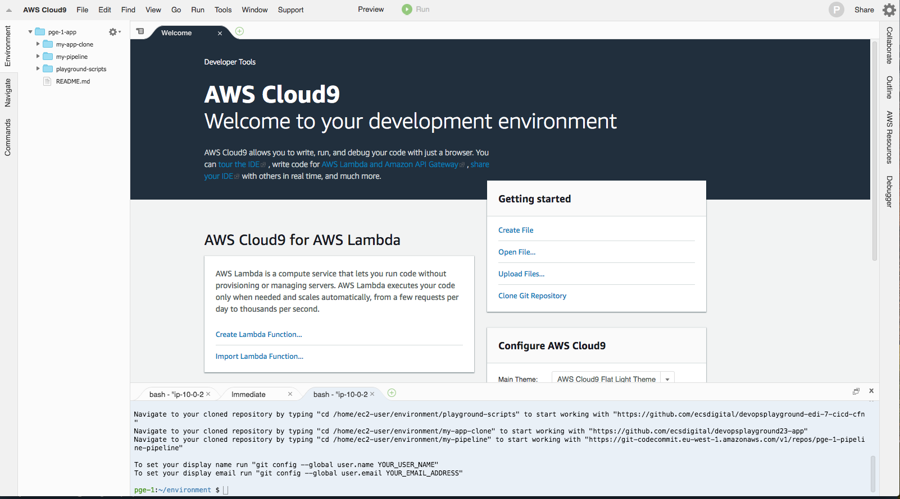
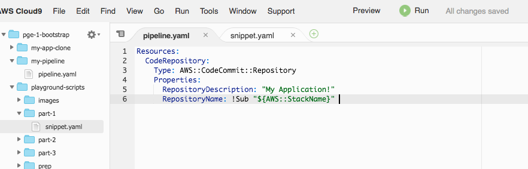

# DevOps Playground Edinburgh - Serverless CICD with AWS CloudFormation


- [Overview](#overview)
- [Hands On](#hands-on)
     - [Logging in to the AWS Console](#logging-in-to-the-aws-console)
     - [Your environment](#your-environment)
     - [Creating Your Repository](#creating-your-repository)
     - [Cloning The Application](#cloning-the-application)
     - [Creating Your Pipeline](#creating-your-pipeline)

# Overview
In this playground we're going to create a codepipeline for a small serverless application by using CloudFormation. We will do this iteratively by introducing new resources with each commit. You have been provided with an environment to view and edit code, a repository to push your pipeline script and a CD pipeline which will deploy your changes automatically.

# Hands On
Ok so lets get stuck in. We'll be creating a complete end to end pipeline for a new application.

### Logging in to the AWS Console
You can skip this section if you are using your own account and have appropriate permissions.

To login to the training account follow the link:-

https://ecsd-training.signin.aws.amazon.com/console

Use the credentials provided during the meetup to login.


When logged in, ensure that you have the region "Ireland" selected (otherwise known as eu-west-1) - all of the prep work has been done in this region.


### Your Environment
We've provided a complete environment to enable you to edit and commit CloudFormation code and a build pipeline to execute it with. Cloud9 gives us a nice code editor and also a terminal window configured with access to the appropriate repositories to build our pipeline and clone our sample application.

In the search bar under AWS services, search for cloud9


You should by default be navigated to the "Your environments" tab where you will see an environment available to you (named similarly to the username you were allocated).

Click the "Open IDE" button shown :-


The environment should open in a new tab, and after a short wait a small bash script will run in the terminal window which populates the environment



You should have 3 repositories cloned and showing in the folder pane on the left-hand-side :-


__my-app-clone__ :- This is a clone of the repository https://github.com/ecsdigital/devopsplayground23-app - it contains a simple Hello World NodeJs express app which we'll be deploying in the pipeline you create. We need this clone so we can push the contents to our new repository when we create it. This is read-only

__my-pipeline__ :- This is an empty repository into which we'll be committing our cloudformation template to build our pipeline. The template must be called template.yaml and must be in the root of this folder. More on this shortly. You have permission to push to this repository through your iam user, that will be the mechanism through which we execute our pipeline template.

__playground-scripts__ :- A clone of this repository, which contains copies of the cloudformation that you can run to create your pipeline. This was included to give an easy way to view and copy scripts inside the environment. This is also read-only.

At the bottom of the page, there is a terminal window pane


This is where we will enter the git commands to commit our code to source control.

The largest pane visible is the file viewer


This is where you can view and edit code. We'll mostly be copying and pasting in this window but there's also support for things like breakpoints (when debugging lambda for example).

### Creating Your Repository

First lets create our template. Your environment will expect a template called "pipeline.yaml", so right-click on the my-pipeline folder and click New File.


Name the file pipeline.yaml, then double-click the file to open.


In "playground-scripts/part-1", double-click on "snippet.yaml" to open the file. It should look something like this :-

```
Resources:
  CodeRepository:
    Type: AWS::CodeCommit::Repository
    Properties:
      RepositoryDescription: "CodeCommit repository for project"
      RepositoryName: !Sub "${AWS::StackName}"
```

The CodeCommit::Repository resource only requires a RepositoryName (we're just using the stack name here which should be pge-x-app), but it's useful to provide a description as well. In addition you can define triggers to do notifications based on repository events such emailing users when someone commits to master - see the docs for more details.

Our first snippet defines a source control repository in CodeCommit for us to check-in our application source code. CodeCommit is a fully git compatible, AWS managed source control solution.

First copy the code from the snippet.yaml, usual OS shortcuts apply here so CMD+A, CMD+C should work (in MacOs, Windows is likely ALT). Now open the pipeline.yaml from the my-pipeline folder and pase the code in. Press CMD+S to save pipeline.yaml



Next we need to check this into source control. So in the terminal we use the following commands

```
cd my-pipeline
git add .
git commit -m "Added pipeline.yaml"
git push origin master
```


This will trigger the pre-configured pipeline to run, navigate to CodePipeline by going to your previous browser tab and using the services > search to find CodePipeline


You'll see a list of existing pipelines, note we've provided these in order to run your source controlled cloudformation script, you'll be creating your own for the application pipeline (think of this as the pipeline's pipeline :) )


Select the one with the same prefix as your user name (e.g. pge-1). You should see that your commit triggered a Source action in your pipeline, followed by a build and deploy action - this may be in a different state from the screenshot depending when you view and how long it took.


Wait until the deploy stage has completed and nagivate to CloudFormation

Either through search :-


Or through the detais link which appears in the deploy action.


The CloudFormation UI should show that you have a new stack with a single resource, which should be your CodeCommit repository.


And sure enough if we look at the CodeCommit repository list, we can see our new repository!


Okay, so we've successfully create a source control repository for our application source code!

But that's just the beginning!

### Cloning the application

So we have source control, but as yet no source. We need to push the contents of the my-app-clone folder from your Cloud9 environment to your new repository so the first thing we need is the push url of your CodeCommit repo.

Goto the CodeCommit UI using the search.

In the CodeCommit dashboard you should see a repository prexifed with your user name and suffixed with -app :-

If so, great! You now need to click on the repo and get the Clone Url, when you click the repo in the list, the first screen usually shows a "Connect to your repository" pane. You need to use the https URL in this case.


If you don't see this pane, you can instead click the "Clone URL" dropdown button shown, this copies the url for you to paste in elsewhere :-


Once you have the URL copied (make sure it's https), return to your Cloud9 environment. Next we need to push the my-app-clone folder/repo to the URL you copied. To do this :-

```
cd ~/environment/my-app-clone
git push {YOUR_COPIED_URL}
```
E.g.


If you want you can view your repo and ensure that the code has been committed, open your CodeCommit repository :-


Excellent! So now we have a repository with an application ready to have the first iteration released! So now what we need is a way to do that...

### Creating your pipeline

Return to your Cloud9 environment.

In order to release our code we need to start building a pipeline. For this we need a number of resources.

1) A CodePipeline. We need a minimum of 2 actions in order to create the pipeline.
2) A way to run the code's build actions.
3) A way to deploy the application.

CodePipeline requires 2 actions so we'll deal with 1 + 2 together.

Lets go back to Cloud9.

Open the snippet.yaml file in the part-2 sub-folder of the playground-scripts folder. This snippet contains a number of new resources which are required for a minimal pipeline. 

Pipeline:- This is the CodePipeline resource. CodePipeline allows you to define stages and actions which occur during your CI/CD process. Actions are generally going to call out to other services (AWS or custom resources), for example to perform build steps we use CodeBuild and for deployment we can use CloudFormation or Amazon ECS.

Let's walk through the properties defined here
```
  Pipeline:
    Type: AWS::CodePipeline::Pipeline
    Properties:
      Name: !Sub '${CodeRepository.Name}-pipeline'
      RoleArn: !GetAtt PipelineRole.Arn
      ArtifactStore:
        Location: !Ref ArtifactAndDeploymentBucket
        Type: S3
      Stages:
```

__Name__ :- Defines the name of the pipeline shown in the UI

__ArtifactStore__ :- CodePipeline needs storage in order to persist artifacts between stages. We are using S3, so we specify the bucket that we wish the artifacts to be stored in.

__RoleArn__ :- CodePipeline must assume an IAM role in order to gain permissions to perform AWS actions. There is a minimal role documented by AWS, but you may require additional permissions which you can define here.

__Stages__ :- Here is where we defined the steps of the pipeline. Stages are sequential, but can contain parallel actions. In our case for now we just want 2 stages. Firstly, grab the source. Secondly, build the template.

```
Stages:
-
    Name: Source
    Actions:
    -
        Name: Source
        Actions:
        -
            Name: Checkout
            ActionTypeId:
                Category: Source
                Owner: AWS
                Version: 1
                Provider: CodeCommit
            OutputArtifacts:
                - Name: CFNTemplateOutput
            Configuration:
                BranchName: master
                RepositoryName: !GetAtt CodeRepository.Name
            RunOrder: 1
    -
        Name: PackageCloudFormation
        Actions:
        -
            Name: PackagePipelineCFN
            ActionTypeId:
                Category: Build
                Owner: AWS
                Version: 1
                Provider: CodeBuild
            Configuration:
                ProjectName: !Ref CodeBuildProject
            InputArtifacts: 
                - Name: CFNTemplateOutput
            OutputArtifacts:
                - Name: PackagedCFN
            RunOrder: 1
```

We won't go into detail about these options, the two stages are 1) grab source from a CodeCommit repository and 2) run a CodeBuild Project.... But we haven't defined the CodeBuild project yet.

A CodeBuild project is a specification defining how to run your build steps, so that's what we need to define next.

```
CodeBuildProject:
    Type: AWS::CodeBuild::Project
    Properties:
        Artifacts:
          Type: CODEPIPELINE
        Source:
          Type: CODEPIPELINE
          BuildSpec: |
            version: 0.2
            phases:
              install:
                commands:
                  - npm install
              build:
                commands:
                  - !Sub "aws cloudformation package \
                              --template-file template.yaml \
                              --output-template-file output.yaml \
                              --s3-bucket $DeploymentBucketName \
                              --region eu-west-1"
            artifacts:
              files: ./**
        Environment:
          ComputeType: BUILD_GENERAL1_SMALL
          Image: aws/codebuild/nodejs:10.1.0
          Type: LINUX_CONTAINER
          EnvironmentVariables:
            - Name: DeploymentBucketName
              Type: PLAINTEXT
              Value: !Ref ArtifactAndDeploymentBucket
        Name: !Sub "${AWS::StackName}-buildproject"
        ServiceRole: !Ref PipelineRole  
```  

The most important parts of this snippet are the BuildSpec, which define the commands required to get your application into a built and deployable state and also the artifacts, which will be used in later build stages (e.g. CloudFormation templates). These commands could also potentially be used for linting, running unit tests, validation etc, perhaps even as separate codebuild configurations. It's worth noting that you can share codebuild projects between different codebases if you're clever (e.g. put buildspec in your source control).

Also important is the Environment which specifies first the performance level your build requires (which affects cost and performance), and also which container image to use to run the build steps. And finally, what IAM role to assume - there is a standard spec in the AWS documentation, but we require some customisation for our build steps to work because we need to write a cloudformation template to S3.

Ok so with the descriptions out of the way, copy the contents of part-2/snippet.yaml to your pipeline.yaml, save the file, then with the same git commands as before, add, commit and push the changes.

```
cd ~/environment/my-pipeline
git add .
git commit -m "added pipeline to template"
git push origin master
```

After a short period (monitor your pipeline to see things moving), you should see some new resources in your pge app stack, and also an additonal pipeline prefixed with pge-x.
