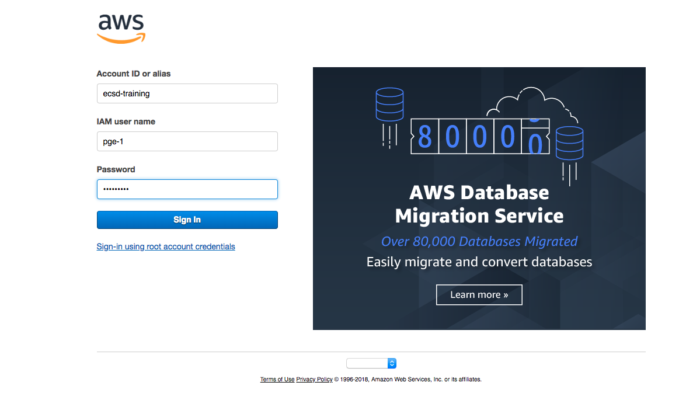

# DevOps Playground Edinburgh - Serverless CICD with AWS CloudFormation

- [Overview](#overview)
- [Hands On](#hands-on)
     - [Logging in to AWS Console](#logging-in-to-aws-console)
     - [Your environment](#your-environment)
     - [Creating Your Repository](#creating-your-repository)
     - [Creating Your Pipeline](#creating-your-pipeline)

# Overview
In this playground we're going to create a codepipeline for a small serverless application by using CloudFormation. We will do this iteratively by introducing new resources with each commit. You have been provided with an environment to view and edit code, a repository to push your pipeline script and a CD pipeline which will deploy your changes automatically.

# Hands On
Ok so lets get stuck in. We'll be creating a complete end to end pipeline for a new application.

### Logging in to the AWS Console
You can skip this section if you are using your own account and have appropriate permissions.

To login to the training account follow the link:-

https://ecsd-training.signin.aws.amazon.com/console

Use the credentials provided during the meetup to login.

When logged in, ensure that you have the region "Ireland" selected (otherwise known as eu-west-1) - all of the prep work has been done in this region.

### Your Environment
We've provided a complete environment to enable you to edit and commit CloudFormation code and a build pipeline to execute it with. Cloud9 gives us a nice code editor and also a terminal window configured with access to the appropriate repositories to build our pipeline and clone our sample application.

In the search bar under AWS services, search for cloud9

You should by default be navigated to the "Your environments" tab where you will see an environment available to you (named similarly to the username you were allocated).

Click the "Open IDE" button shown :-

The environment should open in a new tab, and after a short wait a small bash script will run in the terminal window which populates the environment

You should have 3 repositories cloned and showing in the folder pane on the left-hand-side :-

my-app-clone :- This is a clone of the repository https://github.com/ecsdigital/devopsplayground23-app - it contains a simple Hello World NodeJs express app which we'll be deploying in the pipeline you create. We need this clone so we can push the contents to our new repository when we create it. This is read-only

my-pipeline :- This is an empty repository into which we'll be committing our cloudformation template to build our pipeline. The template must be called template.yaml and must be in the root of this folder. More on this shortly. You have permission to push to this repository through your iam user, that will be the mechanism through which we execute our pipeline template.

playground-scripts :- A clone of this repository, which contains copies of the cloudformation that you can run to create your pipeline. This was included to give an easy way to view and copy scripts inside the environment. This is also read-only.

At the bottom of the page, there is a terminal window pane

This is where we will enter the git commands to commit our code to source control.

The largest pane visible is the file viewer

This is where you can view and edit code. We'll mostly be copying and pasting in this window but there's also support for things like breakpoints (when debugging lambda for example).

### Creating Your Repository